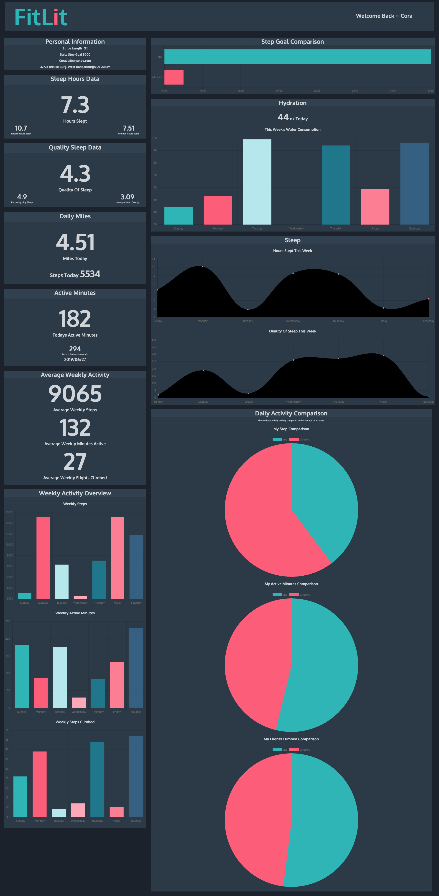
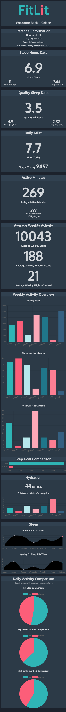

# FitLit 

by: Emily Lalonde and Alyssa Lundgren

FitLit is an activity tracker that displays user's hydration, sleep and activity utilizing jsCharts and object oriented programming. Data is brought in from various files and integrated into a cohesive user dashboard.

## Screenshots
### Full Screen

### Mobile Layout
